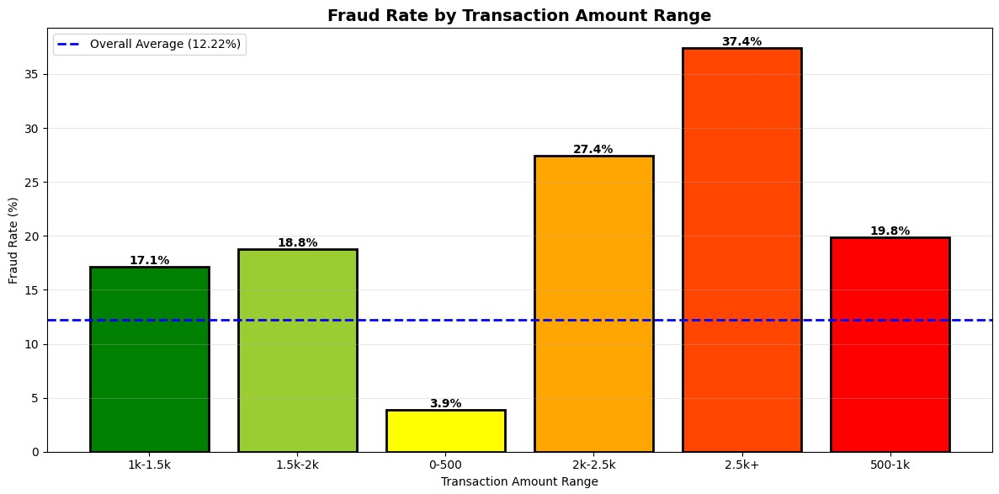

# Fraud Detection Case Study – Risk Analyst

## Overview
This project analyzes transactional payment data to uncover fraud patterns and propose effective anti-fraud solutions for the payment industry. The study leverages PySpark/SQL for scalable analysis and focuses on actionable insights tailored for real-world business impact.

## Project Structure
The work is divided into five main phases:
1. **Data Exploration & Baseline**: Initial data profiling, establishing fraud rates, and highlighting missing information.
2. **Fraud Pattern Analysis**: Identification of core behaviors (velocity attacks, multi-card/device schemes, temporal/merchant focusing).
3. **Recommendations & Anti-Fraud Design**: Actionable rules and scoring architectures to drastically reduce fraud.
4. **Industry Context**: Process mapping, acquirer vs. sub-acquirer explanation, chargeback mechanics.
5. **Results Presentation**: Key findings, financial loss breakdown, and projected impact from implementing recommendations.

## Key Findings
- **High Risk Detected**: Fraud rate at 12.2% (vs. industry average 0.5–1%), indicating elevated risk or curated dataset.
- **Targeting High-Value Transactions**: Transactions above 2,500 have a 37% fraud rate, representing 23% of all losses.
- **Organized Attack Patterns**: Velocity attacks (multiple purchases within 30 minutes), entity abuse (users with 5+ cards), and compromised merchants.
- **Actionable Impact**: With behavioral rules, the fraud rate drops from 12.2% to 3–5%, saving an estimated 370k–430k annually, with less than 2% false positives.

## Technologies Used
- PySpark, SQL (advanced analytics)
- Google Colab (notebook environment)
- Pandas, Matplotlib, Seaborn (visualization)

## Sample Visuals
Fraud Rate by Transaction Amount

## How to Reproduce
- Open the notebook with Google Colab.
- Upload `transactional-sample.csv` as described in the first notebook cell.
- Run each cell sequentially; the code handles all data processing and visualization steps.

## Documentation
- [View Notebook](Risk_Analyst_Case_Alex_Vechi.ipynb)
- [View PDF Summary](Risk-Analyst_Case_Alex_Vechi.pdf)

## Contact
- [LinkedIn](https://linkedin.com/in/alexandre-vechi-maciel)
- Email: alexandre.vechim@gmail.com

